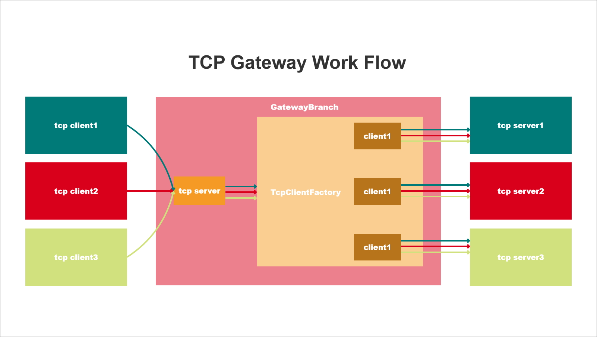

# GatewayBranch

## [中文文档](README.ZH-CN.MD)

GatewayBranch is a lightweight gateway forwarding tool developed based on DotNet



# How to use

import package

```c#
using GatewayBranch.Core;
```

add service

```c#
services.AddGatewayBranch(hostContext.Configuration);
```

config appsettings.json

```json
  "Gateway": {
    "TcpPort": 2012, // listener port
    "BrabchServer": [
      {
        "Ip": "127.0.0.1", // branch server ip
        "Port": 808, // branch server port
        "NeedReply": true // if `true` branch port downstream data,else do nothing
      },
      {
        "Ip": "127.0.0.1",
        "Port": 809,
        "NeedReply": true
      }
    ]
  }
```

# Run in docker

the docker image [yedajiang44/gatewaybranch](https://hub.docker.com/r/yedajiang44/gatewaybranch)

- download `docker-compose.yml`
- exec `docker-compose up -d`

## note

> If you need to map configuration file, you need to create the corresponding file

- `appsettings.json` content see [appsettings.json](./src/GatewayBranch.Application/appsettings.json) , see [GatewayConfiguration](./src/GatewayBranch.Core/Server/GatewayConfiguration.cs) for specific gateway configuration items
- ~~`nlog.config` content see [nlog.config](./src/GatewayBranch.Application/nlog.config)~~

# Roadmap

- add udp
- add session mananger webapi
